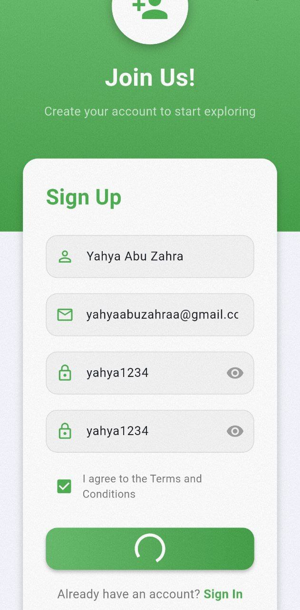
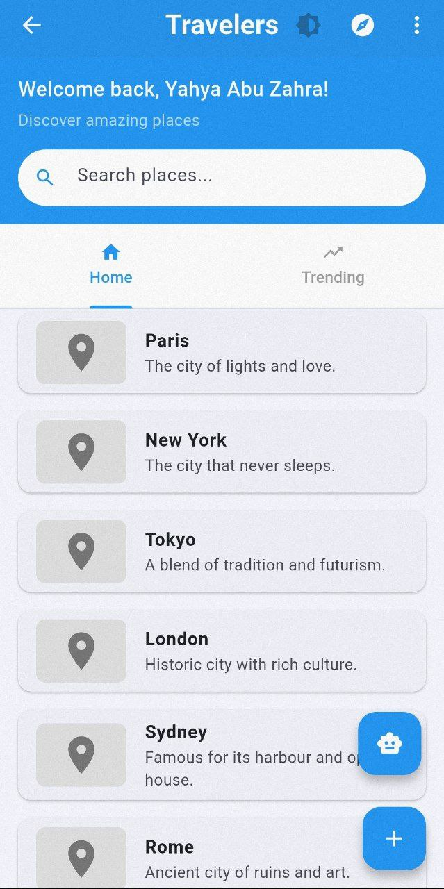
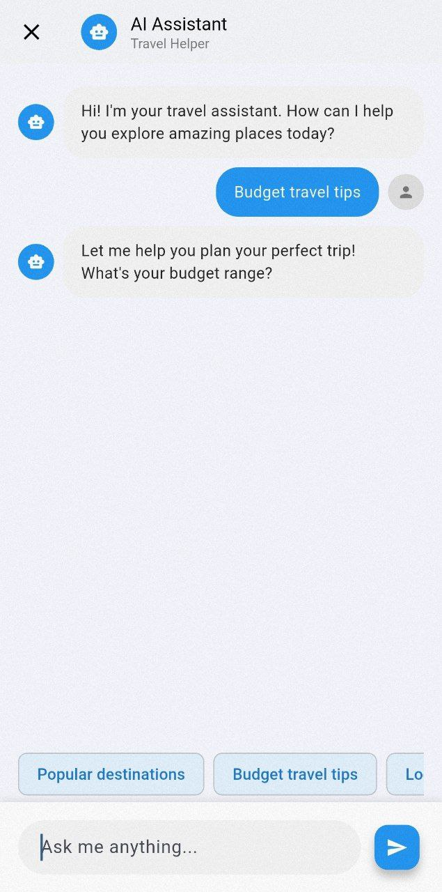
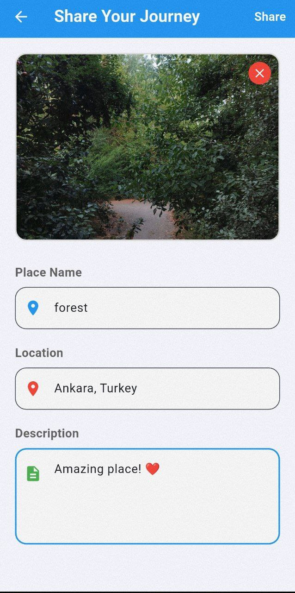
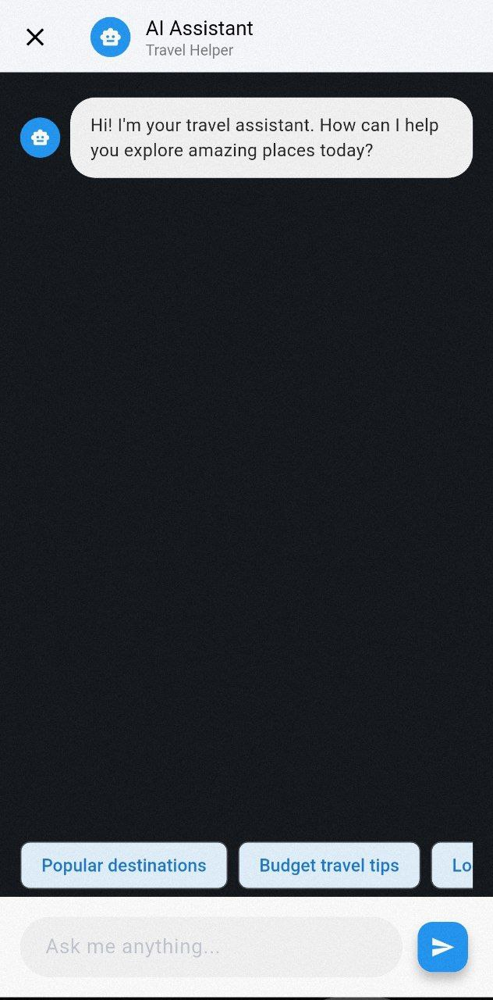
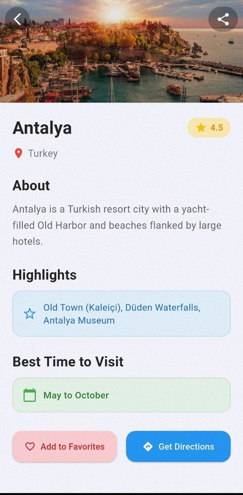

# 🧭 Travel App

**Travel App** is a modern mobile application built using **Flutter** that helps users discover top travel destinations around the world.  
It features user authentication, AI assistance, location integration, and user-generated travel posts — making it an ideal companion for explorers and tourists.

---

## 🔐 Features

- User authentication with **Firebase Authentication** (Sign Up, Login, Logout)
- Post storage using **Firebase Realtime Database** and **Firebase Cloud Storage**
- AI Assistant to help users explore and interact using natural language
- Location integration to open directions in **Google Maps**
- Light and dark theme toggle support
- User-generated content (posts, images, places)
- Smart search for destinations and posts
- Image upload and display for places and posts

---

## 📸 Screenshots

### 🧾 Authentication & Main Pages
| Sign Up | Home | AI Assistant |
|--------|------|--------------|
|  |  |  |

### 👤 User Interaction
| Profile | Search | Share |
|--------|--------|-------|
|  |  |  |

### 🌗 Themes & Settings
| Sign Out | AI in Dark | Dark Theme |
|----------|------------|------------|
|  |  |  |

### 🗺 Place View
| Place Details |
|---------------|
|  |


## 🚀 Technologies Used

- **Flutter** (Dart)
- **Firebase Authentication**
- **Firebase Realtime Database**
- **Firebase Cloud Storage**
- **Google Maps (via URL launcher)**
- **Custom AI Chat Assistant**
- **Git & GitHub** for version control

---

## ▶️ How to Run

1. **Clone the repository:**
   ```bash
   git clone https://github.com/YOUR_USERNAME/travel-app.git
   cd travel-app

2.Install dependencies:

flutter pub get

3. Configure Firebase:

Set up your Firebase project and download google-services.json (for Android) or GoogleService-Info.plist (for iOS).

Place them in the correct platform directories.

Enable Authentication, Realtime Database, and Cloud Storage in the Firebase Console.

4. Run the app:

flutter run
⚠️ Requires Flutter SDK installed and a connected emulator or real device.